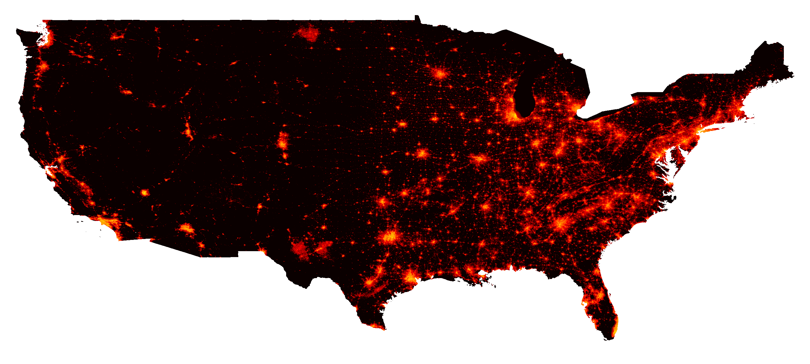
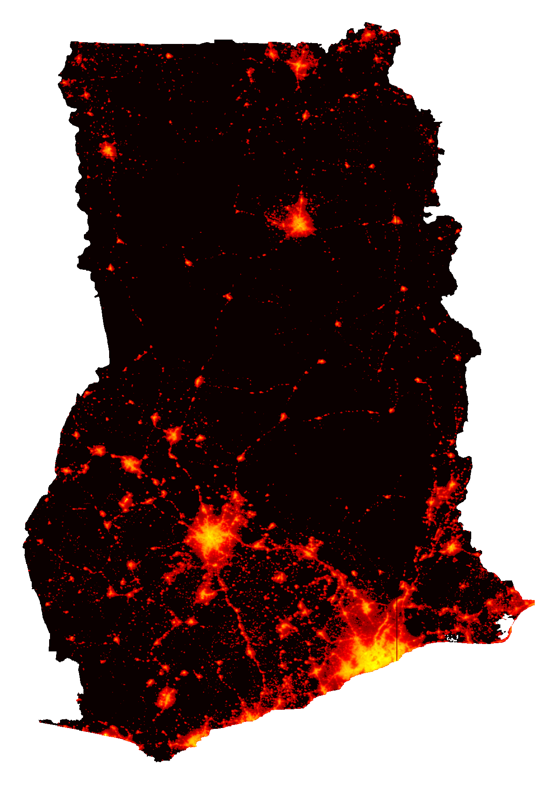
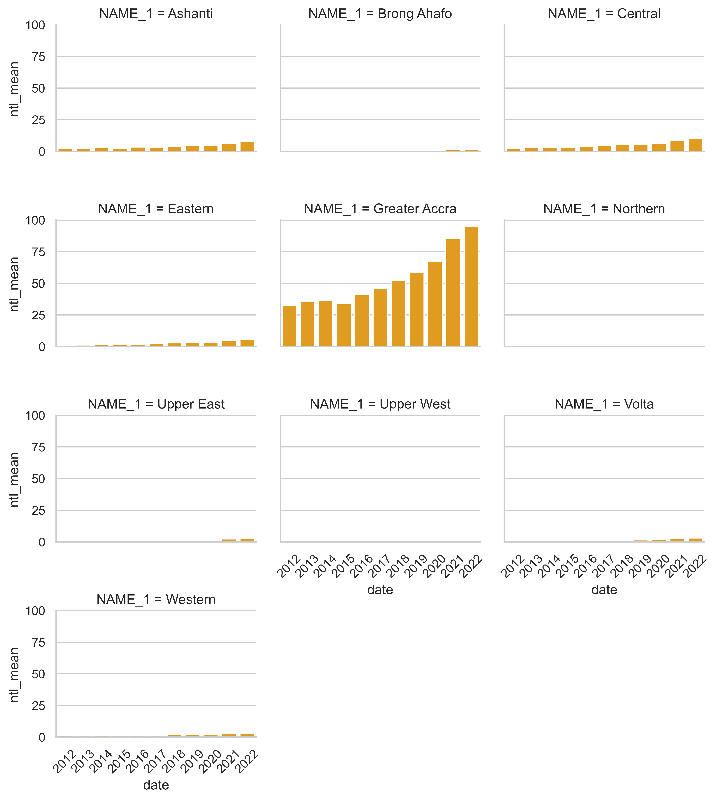

# blackmarblepy

[](https://codecov.io/gh/worldbank/blackmarblepy)
[](https://github.com/worldbank/blackmarblepy/actions/workflows/main.yml)

<p align="center">

</p>

Create Georeferenced Rasters of Nighttime Lights from [NASA Black Marble data](https://blackmarble.gsfc.nasa.gov/).

* [Overview](#overview)
* [Installation](#installation)
* [Bearer token](#token)
* [Functions and arguments](#function-args)
  * [Functions](#functions)
  * [Required Arguments](#args-required)
  * [Optional Arguments](#args-optional)
  * [Argument only for `bm_extract`](#args-extract)
* [Quick start](#quickstart)
  * [Setup](#quickstart-setup)
  * [Nighttime Lights Raster](#quickstart-raster)
  * [Nighttime Lights Trends](#quickstart-trends)
* [Additional Usage](#usage)

## Overview <a name="overview"></a>

This package facilitates downloading nighttime lights [Black Marble](https://blackmarble.gsfc.nasa.gov/) data. Black Marble data is downloaded from the [NASA LAADS Archive](https://ladsweb.modaps.eosdis.nasa.gov/archive/allData/5000/VNP46A3/).  The package automates the process of downloading all relevant tiles from the NASA LAADS archive to cover a region of interest, converting the raw files (in H5 format) to georeferenced rasters, and mosaicing rasters together when needed.

## Installation <a name="installation">

The package can be installed via pip.

```bash
pip install git+https://github.com/worldbank/blackmarblepy.git
```

```py
from blackmarblepy.bm_raster import bm_raster
from blackmarblepy.bm_extract import bm_extract
```

## Bearer Token <a name="token">

The function requires using a **Bearer Token**; to obtain a token, follow the below steps:

1. Go to the [NASA LAADS Archive](https://ladsweb.modaps.eosdis.nasa.gov/archive/allData/5000/VNP46A3/)
2. Click "Login" (bottom on top right); create an account if needed.
3. Click "See wget Download Command" (bottom near top, in the middle)
4. After clicking, you will see text that can be used to download data. The "Bearer" token will be a long string in red.

## Functions and arguments <a name="function-args">

### Functions <a name="functions">

The package provides two functions:

* `bm_raster` produces a raster of Black Marble nighttime lights.
* `bm_extract` produces a dataframe of aggregated nighttime lights to a region of interest (e.g., average nighttime lights within US States).

Both functions take the following arguments:

### Required arguments <a name="args-required">

* **roi_sf:** Region of interest; geopandas dataframe. Must be in the [WGS 84 (epsg:4326)](https://epsg.io/4326) coordinate reference system. For `bm_extract`, aggregates nighttime lights within each polygon of `roi_sf`.

* **product_id:** One of the following:

  * `"VNP46A1"`: Daily (raw)
  * `"VNP46A2"`: Daily (corrected)
  * `"VNP46A3"`: Monthly
  * `"VNP46A4"`: Annual

* **date:**  Date of raster data. Entering one date will produce a raster. Entering multiple dates will produce a raster stack.

  * For `product_id`s `"VNP46A1"` and `"VNP46A2"`, a date (eg, `"2021-10-03"`).
  * For `product_id` `"VNP46A3"`, a date or year-month (e.g., `"2021-10-01"`, where the day will be ignored, or `"2021-10"`).
  * For `product_id` `"VNP46A4"`, year or date  (e.g., `"2021-10-01"`, where the month and day will be ignored, or `2021`).

* **bearer:** NASA bearer token. For instructions on how to create a token, see [here](https://github.com/worldbank/blackmarblepy#bearer-token-).

### Optional arguments <a name="args-optional">

* **variable:** Variable to used to create raster (default: `NULL`). For information on all variable choices, see [here](https://ladsweb.modaps.eosdis.nasa.gov/api/v2/content/archives/Document%20Archive/Science%20Data%20Product%20Documentation/VIIRS_Black_Marble_UG_v1.2_April_2021.pdf); for `VNP46A1`, see Table 3; for `VNP46A2` see Table 6; for `VNP46A3` and `VNP46A4`, see Table 9. If `NULL`, uses the following default variables:

  * For `product_id` `"VNP46A1"`, uses `DNB_At_Sensor_Radiance_500m`.
  * For `product_id` `"VNP46A2"`, uses `Gap_Filled_DNB_BRDF-Corrected_NTL`.
  * For `product_id`s `"VNP46A3"` and `"VNP46A4"`, uses `NearNadir_Composite_Snow_Free`.

* **quality_flag_rm:** Quality flag values to use to set values to `NA`. Each pixel has a quality flag value, where low quality values can be removed. Values are set to `NA` for each value in ther `quality_flag_rm` vector. (Default: `[255]`).

  * For `VNP46A1` and `VNP46A2` (daily data):
    * `0`: High-quality, Persistent nighttime lights
    * `1`: High-quality, Ephemeral nighttime Lights
    * `2`: Poor-quality, Outlier, potential cloud contamination, or other issues
    * `255`: No retrieval, Fill value (masked out on ingestion)

  * For `VNP46A3` and `VNP46A4` (monthly and annual data):
    * `0`: Good-quality, The number of observations used for the composite is larger than 3
    * `1`: Poor-quality, The number of observations used for the composite is less than or equal to 3
    * `2`: Gap filled NTL based on historical data
    * `255`: Fill value

* **output_location_type:** Where output should be stored (default: for `bm_raster`, `"tempfile"`; for `bm_extract`, `"memory"`). Either:

  * [For `bm_raster`] `tempfile` where the function will export the raster as a tempfile
  * [For `bm_extract`] `memory` where the function will export the data as pandas dataframe
  * `file` where the function will export the data as a file. For `bm_raster`, a `.tif` file will be saved; for `bm_extract`, a `.csv` file will be saved. A file is saved for each date. Consequently, if `date = [2018, 2019, 2020]`, three datasets will be saved: one for each year. Saving a dataset for each date can facilitate re-running the function later and only downloading data for dates where data have not been downloaded.

If `output_location_type = "file"`, the following arguments can be used:

* **file_dir:** The directory where data should be exported (default: `NULL`, so the working directory will be used)
* **file_prefix:** Prefix to add to the file to be saved. The file will be saved as the following: `[file_prefix][product_id]_t[date].[tif/csv]`
* **file_skip_if_exists:** Whether the function should first check wither the file already exists, and to skip downloading or extracting data if the data for that date if the file already exists (default: `TRUE`). If the function is first run with `date = c(2018, 2019, 2020)`, then is later run with `date = c(2018, 2019, 2020, 2021)`, the function will only download/extract data for 2021. Skipping existing files can facilitate re-running the function at a later date to download only more recent data.

### Argument for `bm_extract` only <a name="args-extract">

* **aggregation_fun:** A vector of functions to aggregate data (default: `"mean"`). The `zonal_stats` function from the `rasterstats` package is used for aggregations; this parameter is passed to `stats` argument in `zonal_stats`.

## Quickstart <a name ="quickstart">

### Setup <a name="quickstart-setup"></a>

Before downloading and extracting Black Marble data, we first load libraries, define the NASA bearer token, and define a region of interest.

```python
## Libraries
from blackmarblepy.bm_raster import bm_raster
from blackmarblepy.bm_extract import bm_extract

import matplotlib.pyplot as plt
import numpy as np
import pandas as pd
from gadm import GADMDownloader
import seaborn as sns

## Bear token
bearer == "BEARER TOKEN HERE"

## Get Region of Interest - Ghana
downloader = GADMDownloader(version="4.0")

country_name = "Ghana"
ghana_adm1 = downloader.get_shape_data_by_country_name(country_name=country_name,
                                                       ad_level=1)
```

### Raster of Nighttime Lights <a name="quickstart-raster"></a>

The below example shows making an annual raster of nighttime lights for Ghana.

```python
## Raster of nighttime lights
r = bm_raster(roi_sf = ghana_adm1,
              product_id = "VNP46A4",
              date = 2022,
              bearer = bearer)

## Map raster
r_np = r.read(1)
r_np = np.log(r_np+1)

plt.imshow(r_np, cmap='hot')
plt.tight_layout()
plt.axis("off")
```

<p align="center">

</p>

### Trends in Nighttime Lights <a name="quickstart-trends"></a>

The below example shows extracting average annual nighttime lights data for Ghana at the administrative 1 level and plotting the trends.

```python
## Annual trends in nighttime lights
ntl_df = bm_extract(roi_sf = ghana_adm1,
                    product_id = "VNP46A4",
                    date = list(range(2012, 2023)),
                    bearer = bearer)

## Plot Trends
sns.set(style="whitegrid")
g = sns.catplot(data=ntl_df, kind="bar", x="date", y="ntl_mean", col="NAME_1", height=2.5, col_wrap = 3, aspect=1.2, color = "orange")

# Set the x-axis rotation for better visibility
g.set_xticklabels(rotation=45)

# Adjust spacing between subplots
plt.tight_layout()

# Show the plot
plt.show()
```

<p align="center">

</p>

## Additional Usage <a name="usage">

To see additional examples of using the package, see [here](https://github.com/worldbank/blackmarblepy/blob/main/examples/blackmarbley_example.ipynb).
